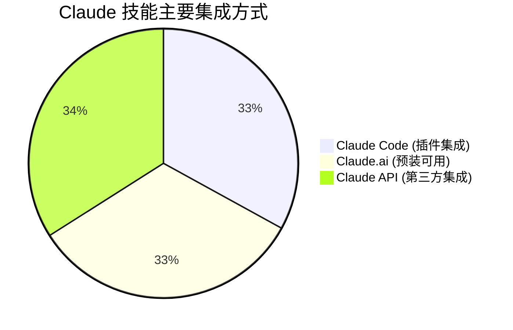
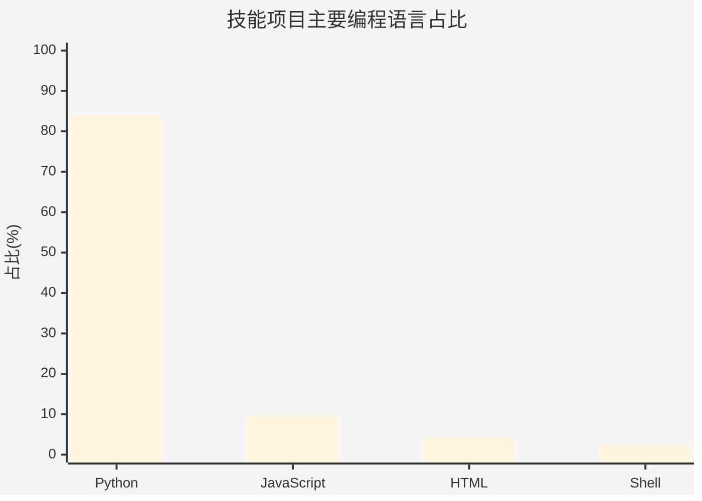

# Anthropic Skills 项目全技能深度分析报告

## 目录

一、[项目概览与背景](https://chatglm.cn/main/alltoolsdetail?t=1768847929211&cid=696e6f986b3c1a57a1818d19&lang=zh#项目概览与背景)
二、[技能体系结构与工作原理](https://chatglm.cn/main/alltoolsdetail?t=1768847929211&cid=696e6f986b3c1a57a1818d19&lang=zh#技能体系结构与工作原理)
三、[技能详解：逐个分析](https://chatglm.cn/main/alltoolsdetail?t=1768847929211&cid=696e6f986b3c1a57a1818d19&lang=zh#技能详解：逐个分析)

- [文档处理技能 (Document Skills)](https://chatglm.cn/main/alltoolsdetail?t=1768847929211&cid=696e6f986b3c1a57a1818d19&lang=zh#文档处理技能-document-skills)
- [创意与设计技能 (Creative & Design Skills)](https://chatglm.cn/main/alltoolsdetail?t=1768847929211&cid=696e6f986b3c1a57a1818d19&lang=zh#创意与设计技能-creative--design-skills)
- [开发与工程技能 (Development & Engineering Skills)](https://chatglm.cn/main/alltoolsdetail?t=1768847929211&cid=696e6f986b3c1a57a1818d19&lang=zh#开发与工程技能-development--engineering-skills)
- [企业与沟通技能 (Enterprise & Communication Skills)](https://chatglm.cn/main/alltoolsdetail?t=1768847929211&cid=696e6f986b3c1a57a1818d19&lang=zh#企业与沟通技能-enterprise--communication-skills)
- [辅助与参考技能 (Utility & Reference Skills)](https://chatglm.cn/main/alltoolsdetail?t=1768847929211&cid=696e6f986b3c1a57a1818d19&lang=zh#辅助与参考技能-utility--reference-skills)

四、[技能的应用与集成](https://chatglm.cn/main/alltoolsdetail?t=1768847929211&cid=696e6f986b3c1a57a1818d19&lang=zh#技能的应用与集成)
五、[技能的创建与最佳实践](https://chatglm.cn/main/alltoolsdetail?t=1768847929211&cid=696e6f986b3c1a57a1818d19&lang=zh#技能的创建与最佳实践)
六、[项目生态与未来展望](https://chatglm.cn/main/alltoolsdetail?t=1768847929211&cid=696e6f986b3c1a57a1818d19&lang=zh#项目生态与未来展望)

## 项目概览与背景

**Anthropic Skills** 是 Anthropic 公司维护的开源项目，旨在通过模块化的"技能（Skills）“扩展 Claude AI 的能力。这些技能本质上是包含指令、脚本和资源的文件夹，可以按需加载到 Claude 的上下文中，从而指导模型完成特定任务。例如，一个技能可以教 Claude 如何遵循公司的品牌指南创建文档，或使用特定工作流分析数据，甚至自动化个人日常任务。通过将专业知识以结构化方式封装，技能使 Claude 从"通用助手"转变为"领域专家”，在不同场景下提供稳定、可复用且可演进的行为。

该项目的核心是提供一个**开放标准的技能系统**（Agent Skills），不仅限于 Claude，还可适用于其他 AI 模型。这意味着开发者可以创建一次技能，在 Claude Code、Claude.ai，甚至通过 Claude API 等多种环境中使用。技能的格式非常简单：一个技能至少包含一个 **SKILL.md** 文件，其中以 YAML 前置元数据开始，定义技能的名称和描述，随后是 Markdown 格式的详细指令。这种设计使得技能易于创建、维护和分发。开发者可以基于官方提供的模板（`template-skill`）快速开始编写新技能，并通过版本控制和代码审查等方式确保技能质量。

**技能的作用**在于为 AI 模型提供"入职手册"般的指导。就像为新员工准备的详细说明文档，技能告诉 Claude 在特定任务中"如何做"，例如生成符合公司规范的营销内容，或按照特定流程测试 Web 应用。通过将这些流程知识模块化，技能可以组合和复用，使 AI 能够像经验丰富的员工一样工作，而无需每次都从头解释。这大大提高了 AI 在专业任务上的表现和一致性。

## 技能体系结构与工作原理

Anthropic Skills 仓库提供了丰富的技能示例，涵盖了**文档处理、创意设计、技术开发、企业沟通**等多个领域。这些技能按照功能分类存放在不同的目录下，形成了一个结构清晰的技能生态系统。仓库的主要结构包括：

- **skills/**：存放各种技能示例的核心目录，分为若干子目录，如 `skills/docx`、`skills/pdf`、`skills/pptx`、`skills/xlsx`（文档处理技能），以及其他创意和工程类技能目录。
- **spec/**：包含 Agent Skills 的规范文档（如 `agent-skills-spec.md`），定义了技能的标准格式和工作原理。
- **template/**：提供一个基础技能模板（`template-skill`），供开发者创建新技能时参考和使用。
- **.claude-plugin/**：包含将此仓库注册为 Claude Code 插件市场源的配置文件，使得用户可以在 Claude Code 中方便地安装和管理这些技能。
- **README.md**：项目的总体说明文档，介绍了技能的概念、用途以及如何在不同产品中使用技能。

这种结构确保了技能的**模块化和可组合性**。每个技能都是独立的模块，可以单独使用，也可以与其他技能协同工作以完成复杂任务。例如，文档处理技能（如 PDF 技能）可以与品牌规范技能（如 Brand Guidelines）结合，确保在填写 PDF 表单时遵循公司的字体和颜色规范。

**技能的工作原理**基于"渐进式披露（Progressive Disclosure）"设计。当 Claude 启动时，它只会预加载每个技能的元数据（名称和描述），而不读取整个技能内容。这保持了系统提示的简洁，同时让 Claude 知道何时可能需要哪个技能。当用户请求与某个技能描述相匹配时，Claude 会提示用户是否启用该技能。一旦用户同意，Claude 才会读取该技能的完整 `SKILL.md` 文件到上下文中。如果技能内容过多，`SKILL.md` 可以引用额外的文件（如参考文档或脚本）作为第三层细节，只有在需要时才由 Claude 按需读取。这种按需加载机制确保了技能不会占用过多的上下文窗口，同时又能够提供近乎无限量的指导信息和资源。

## 技能详解：逐个分析

下面将对仓库中提供的**全部技能**进行逐一介绍和分析。这些技能按照功能领域划分为几大类，包括文档处理、创意设计、开发工程、企业沟通等。每个技能都有其独特的用途和特点，我们将在下文中详细说明。

### 文档处理技能 (Document Skills)

文档处理技能是 Anthropic Skills 仓库中非常重要的组成部分，它们为 Claude 提供了对常见办公文档格式的底层处理能力。这些技能展示了如何将 AI 与文件系统操作和代码执行相结合，以实现对 PDF、Word、PowerPoint、Excel 等文件的专业处理。

#### PDF 技能 (pdf)

**功能概述：** PDF 技能让 Claude 直接操作 PDF 文件，包括提取文本和表格、填写表单、合并拆分文件、添加水印、OCR 文字识别、加密解密等。这使得 Claude 能够像专业工具一样处理 PDF，而不仅仅是读取其内容。例如，用户可以让 Claude 填写一份 PDF 申请表，或者从多份报告中提取数据汇总。

**核心特点：** 该技能包含多个 Python 脚本和参考文档。核心脚本有 `extract_form_field_info.py`（提取 PDF 表单字段信息）、`fill_fillable_fields.py`（填写可填写的 PDF 表单）、`convert_pdf_to_images.py`（将 PDF 转换为图像以便预览或处理）等。这些脚本利用了 `pypdf` 等库，并经过精心设计以保持结果的一致性和可重复性。技能还包含边界框验证脚本（`check_bounding_boxes.py`），用于确保填写表单时内容不会超出字段范围，从而提高准确性。

**使用场景：** PDF 技能适用于任何涉及 PDF 处理的场景。例如，HR 员工可以用它批量填写员工信息表单，律师可以用它提取合同中的关键条款，开发人员可以用它解析 API 文档中的表格数据等。通过该技能，Claude 能够执行许多以往需要人工或专门软件才能完成的任务，大幅提升工作效率。

**实现细节：** PDF 技能的 `SKILL.md` 文件首先定义了技能的元数据，然后包含对各种功能的说明和示例。它引用了额外的文档（`forms.md`）来详细说明表单填写流程，以及一个参考文档（`reference.md`）提供 PDF 处理的全面功能列表。这种结构让核心 `SKILL.md` 保持简洁，而将高级用法和细节放在附属文件中，符合渐进式披露原则。

#### DOCX 技能 (docx)

**功能概述：** DOCX 技能让 Claude 创建和编辑 Microsoft Word (.docx) 文档，支持完整的 OOXML 标准（ISO/IEC 29500-4）。这包括生成新文档、修改现有文档内容、应用样式、插入表格和图片，以及处理文档的修订（redlining）和批注（comments）。用户可以让 Claude 按照公司模板生成报告，或在合同草稿上添加批注和修订标记。

**核心特点：** 该技能非常复杂，包含完整的 Open XML 架构定义和处理脚本。技能目录下有一个 `ooxml` 子目录，存放了 ECMA-376 和 ISO/IEC 29500-4 标准的 XML 架构文件（`.xsd`），以及用于验证和打包/解包 OOXML 文档的 Python 脚本。这些脚本（`pack.py`、`unpack.py`、`validate.py`）可以读取和生成符合规范的 `.docx` 文件，并进行校验确保格式正确。此外，技能还提供了一些 XML 模板（在 `templates` 目录下），用于插入批注、扩展批注等，方便 Claude 在编辑文档时直接应用。

**使用场景：** DOCX 技能适用于需要与 Word 文档交互的任何场景。例如，市场部门可以用它生成营销计划文档并应用公司样式，法律部门可以用它在合同上添加批注和修订以供审阅，开发团队可以用它生成 API 文档模板并填充内容。通过该技能，Claude 能够像熟练使用 Word 一样处理文档，同时保持格式和结构的完整性。

**实现细节：** DOCX 技能的 `SKILL.md` 提供了多种工作流的指导，包括如何从头创建文档、如何编辑现有文档（使用基础编辑或修订工作流）等。它还解释了何时使用文本提取、何时直接操作 XML 结构等高级技巧。技能的复杂度使其包含了多个辅助文件，如 `docx-js.md`（说明如何使用 Docx.js 库）和 `ooxml.md`（介绍 Open XML 格式）。这些文件提供了深入的技术细节，只有在 Claude 需要时才会被读取，从而保证了上下文的高效利用。

#### PPTX 技能 (pptx)

**功能概述：** PPTX 技能让 Claude 创建和编辑 PowerPoint (.pptx) 演示文稿。它支持生成新幻灯片、修改现有幻灯片内容、应用高级布局和模板，以及将 HTML 内容转换为 PowerPoint 格式。用户可以让 Claude 根据 HTML 报告自动生成幻灯片，或按照公司模板创建演示文稿并调整样式。

**核心特点：** 该技能包含了一个将 HTML 转换为 PowerPoint 的脚本（`html2pptx.js`），这是实现从网页内容快速生成演示文稿的关键。此外，技能提供了用于管理幻灯片的实用脚本，例如 `inventory.py`（列出幻灯片清单）、`rearrange.py`（重新排序幻灯片）、`replace.py`（批量替换幻灯片中的文本或图片）等。它还包含一个 `thumbnail.py` 脚本，用于为演示文稿生成缩略图，方便预览或管理。技能同样依赖于 Open XML 架构（与 DOCX 技能共享 `ooxml` 目录），确保生成的 `.pptx` 文件符合规范。

**使用场景：** PPTX 技能适用于制作演示文稿的任何场景。例如，销售人员可以用它根据 HTML 产品介绍自动生成幻灯片，培训师可以用它将培训大纲转换为 PPT，开发团队可以用它将项目进度报告转换为可视化的演示。通过该技能，Claude 能够高效地完成从内容到演示的转换，同时保持幻灯片的美观和专业。

**实现细节：** PPTX 技能的 `SKILL.md` 提供了使用说明和示例，如如何从头创建演示文稿、如何编辑现有幻灯片、如何使用高级布局和模板等。它还详细说明了 `html2pptx` 的使用方法，包括如何解析 HTML 结构并映射到幻灯片布局。技能还包含 `html2pptx.md` 文档，深入介绍 HTML 转 PowerPoint 的技术和限制。这些附属文件为 Claude 提供了完成复杂任务所需的额外指导，而不会在常规情况下占用上下文。

#### XLSX 技能 (xlsx)

**功能概述：** XLSX 技能让 Claude 创建和编辑 Microsoft Excel (.xlsx) 电子表格。它支持生成新的工作簿、编辑单元格数据、应用公式和格式，以及进行数据验证。用户可以让 Claude 根据数据生成报表模板并自动计算公式，或按照财务模型创建电子表格并应用专业格式。

**核心特点：** 该技能虽然相对简单，但包含了一个关键脚本 `recalc.py`，用于重新计算 Excel 文件中的公式。这确保了当 Claude 修改数据或插入公式后，表格中的计算结果是正确的。技能本身不依赖复杂的库，但通过调用 Python 脚本，Claude 能够以编程方式读写 `.xlsx` 文件，并保持格式和计算的完整性。

**使用场景：** XLSX 技能适用于涉及 Excel 数据处理的场景。例如，财务团队可以用它根据预算数据生成财务报表并自动计算总计和公式，数据分析师可以用它创建数据模型并进行格式化，运营团队可以用它生成项目进度跟踪表并应用条件格式。通过该技能，Claude 能够像熟练使用 Excel 一样处理电子表格，同时保证公式的准确性和样式的专业。

**实现细节：** XLSX 技能的 `SKILL.md` 提供了使用说明，包括如何创建新工作簿、如何编辑数据和格式、如何使用公式并重新计算等。它还强调了使用该技能时需要注意的事项，例如在写入大量数据时避免覆盖重要内容等。虽然该技能不包含复杂的附属文件，但其简洁的设计保证了 Claude 在执行电子表格任务时能快速获取所需指导。

### 创意与设计技能 (Creative & Design Skills)

创意与设计技能展示了 Claude 在艺术创作和视觉设计方面的潜力。这些技能教 Claude 如何生成艺术作品、设计视觉内容，并遵循美学原则，以避免"AI 生成内容常见的平庸风格"。通过这些技能，Claude 能够创建独特的海报、Logo、算法艺术等作品，满足创意领域的需求。

#### 算法艺术 (algorithmic-art)

**功能概述：** 算法艺术技能让 Claude 能够创建基于算法的生成艺术作品。它使用流行的 p5.js 库来实现各种算法效果，如粒子系统、流场、噪声纹理等。用户可以让 Claude 生成一幅抽象的数字艺术品，例如"基于海洋流动的算法艺术"，Claude 会据此创作一个交互式的 HTML 工件，其中包含 p5.js 生成的动态视觉效果。

**核心特点：** 该技能包含了一个 p5.js 生成器模板（`generator_template.js`）和一个查看器模板（`viewer.html`）。模板提供了标准的结构，确保每次生成的艺术作品都有一致的交互界面（如参数控制面板、种子导航器等）。技能要求 Claude 首先创建一个"算法哲学"（4-6 段落的描述），阐述艺术作品的理念，然后基于该理念生成 p5.js 代码。这种方法确保生成的艺术具有独特的创意和连贯的主题，而不是简单的随机图案。

**使用场景：** 算法艺术技能适用于任何需要生成艺术或视觉内容的场景。例如，艺术家可以用它探索新的创意方向，设计师可以用它生成背景图案或装饰元素，教师可以用它演示数学和艺术结合的教学案例。通过该技能，Claude 能够生成原创的、高质量的艺术作品，同时避免了侵犯他人版权的风险（因为每次生成都是独一无二的）。

**实现细节：** 算法艺术技能的 `SKILL.md` 强调了创意流程：首先定义艺术理念，然后实现技术。它提供了使用该技能的示例步骤，并强调了使用种子随机性以确保结果可重现。技能还包含一个 p5.js 模板文件，Claude 可以基于此模板快速搭建艺术作品的框架。通过将艺术指导和技术实现分离，该技能展示了如何让 Claude 从事创意工作，同时保持结构化和可重复性。

#### 画布设计 (canvas-design)

**功能概述：** 画布设计技能让 Claude 能够创建专业的视觉艺术作品，并以 PNG 或 PDF 格式输出。它强调使用设计哲学来指导创作过程，并集成了丰富的字体库，确保输出的作品在排版和美学上达到博物馆级的质量。用户可以让 Claude 设计一张海报、插画或其他静态视觉作品，Claude 会先制定一个"视觉哲学"，然后据此生成最终的图像文件。

**核心特点：** 该技能最大的亮点是其庞大的字体库。在 `canvas-fonts` 目录下，有 **81 个字体文件**，涵盖 54 种独特的字体系列，包括 Arsenal SC、Big Shoulders、Bricolage Grotesque、Crimson Pro、IBM Plex、Instrument Sans/Serif、JetBrains Mono、National Park、Work Sans、Young Serif 等多种风格。这些字体文件及其开源许可证确保 Claude 在创作时能够选择最合适的字体来传达设计理念。技能要求 Claude 首先创建一个视觉哲学文档，描述设计的理念、风格和元素，然后根据该哲学生成最终作品。

**使用场景：** 画布设计技能适用于需要生成静态视觉作品的场景。例如，市场营销团队可以用它设计活动海报，产品团队可以用它制作产品宣传图，个人可以用它制作个人名片或邀请函。通过该技能，Claude 能够产出高质量的设计，同时避免了直接模仿现有艺术作品的版权风险。

**实现细节：** 画布设计技能的 `SKILL.md` 提供了设计流程指导，强调从设计理念出发。它说明了如何使用技能自带的字体库，并提醒 Claude 选择字体时考虑美学效果和可读性。技能还强调"博物馆级工艺标准"，意味着 Claude 在生成作品时会注重细节和品质。通过将设计理念与技术实现（字体选择、布局构图等）相结合，该技能展示了 Claude 在创意设计领域的潜力。

#### 主题工厂 (theme-factory)

**功能概述：** 主题工厂技能为 Claude 提供了一套预设的设计主题，用于美化各种产出物（如幻灯片、文档、网页等）。它包含 10 种精心设计的主题，每种主题都定义了配色方案和字体搭配，能够赋予作品统一的品牌感和美学风格。用户可以让 Claude 应用某个主题来生成报告，或创建一个新的自定义主题，Claude 会根据该主题调整输出内容的颜色和字体。

**核心特点：** 该技能提供了 10 种预设主题，每种主题都有独特的风格和名称，例如：

- **Arctic Frost (北极霜)**：清冷简洁的蓝白色调。
- **Botanical Garden (植物园)**：自然有机的绿色和棕色调。
- **Desert Rose (沙漠玫瑰)**：温暖柔和的粉橙色系。
- **Forest Canopy (森林树冠)**：深邃宁静的深绿色调。
- **Golden Hour (黄金时刻)**：温暖明亮的金黄橙色调。
- **Midnight Galaxy (午夜银河)**：深邃神秘的深紫色调。
- **Modern Minimalist (现代极简)**：精致克制的黑白灰极简风格。
- **Ocean Depths (海洋深处)**：深邃流动的深蓝色调。
- **Sunset Boulevard (日落大道)**：渐变活力的夕阳色调。
- **Tech Innovation (科技创新)**：未来感的蓝紫色调。

每种主题都有对应的 Markdown 文件定义其配色和字体，方便 Claude 在应用时参考。技能还提供了一个 `theme-showcase.pdf` 文件，作为展示不同主题效果的"图片资源集"，帮助 Claude 理解主题在实际文档中的呈现效果。

**使用场景：** 主题工厂技能适用于任何需要为产出物赋予统一风格的场景。例如，企业可以用它确保所有报告和演示都使用公司主题，设计师可以用它快速尝试不同配色方案，个人可以用它美化简历或博客文章。通过该技能，Claude 能够像设计师一样调整视觉效果，而无需人工逐一指定颜色和字体。

**实现细节：** 主题工厂技能的 `SKILL.md` 提供了主题的列表和说明，并指导 Claude 如何应用或创建主题。它强调使用主题时保持一致性，例如在生成多个页面时应用相同的主题。技能还包含 `themes` 目录，存放每个主题的定义文件，Claude 可以根据需要读取特定主题的详细信息。通过将主题抽象为可配置的资源，该技能展示了如何让 Claude 在视觉设计上具备灵活的"换肤"能力。

#### 品牌指南 (brand-guidelines)

**功能概述：** 品牌指南技能让 Claude 能够在任何产出物中应用 Anthropic 官方的品牌视觉风格。它定义了 Anthropic 的品牌颜色、字体和排版规范，确保 Claude 在生成内容（如文档、网页、报告）时，遵循统一的外观和感觉。用户可以让 Claude 制作一份营销材料，Claude 会自动使用 Anthropic 的品牌橙色和字体，使其看起来像官方出品的内容。

**核心特点：** 该技能提供了 Anthropic 官方的品牌元素定义，包括：

- **主要颜色：** 深色（#141413）用于文本和深色背景，浅色（#faf9f5）用于浅色背景和深色文本，中灰（#b0aea5）用于次要元素，浅灰（#e8e6dc）用于细微背景。
- **强调色：** 橙色（#d97757）作为主要强调色，蓝色（#6a9bcc）作为次要强调色，绿色（#788c5d）作为第三强调色。
- **字体：** 标题使用 Poppins 字体（24pt 及以上大小），正文使用 Lora 字体。如果系统没有安装这些字体，则回退到 Arial（标题）和 Georgia（正文）。

技能通过 Python 脚本（使用 `python-pptx` 库的 `RGBColor` 类）确保颜色在不同系统上保持精确，并通过检查系统字体来决定应用何种字体。它强调智能应用，例如根据背景自动选择合适的文字颜色，保持文本层级和格式等。

**使用场景：** 品牌指南技能适用于需要确保输出符合 Anthropic 品牌规范的场景。例如，开发团队可以用它确保 API 文档使用 Anthropic 的字体和颜色，市场团队可以用它生成新闻稿并自动应用品牌色，个人用户可以用它制作演示文稿并保持 Anthropic 风格。通过该技能，Claude 能够产出与 Anthropic 一致的高质量内容，强化品牌形象。

**实现细节：** 品牌指南技能的 `SKILL.md` 提供了品牌元素的详细定义和使用说明。它包含一个"品牌样式概览"部分，列出颜色代码和字体选择规则。技能还强调了在应用品牌时的注意事项，如确保字体已安装、根据背景调整文本颜色等。通过将品牌规范抽象为技能，Claude 可以在各种产出物中自动应用一致的视觉风格，而无需人工逐项指定。

#### Slack GIF 创建器 (slack-gif-creator)

**功能概述：** Slack GIF 创建器技能让 Claude 能够生成优化的动图（GIF）文件，用于在 Slack 消息或表情中使用。它提供了一套可组合的动画"原语"，如弹跳、爆炸、渐隐、翻转、旋转、缩放等，以及一系列实用工具（如调色板、缓动函数、文本渲染）。用户可以让 Claude 为 Slack 制作一个"跳舞笑脸"的 GIF，Claude 会组合相应的动画原语，并确保最终 GIF 符合 Slack 的大小限制（消息 GIF 最大 2MB，表情 GIF 最大 64KB）。

**核心特点：** 该技能包含 13 种动画原语模板（`templates` 目录下），每个模板实现一种基本动画效果。这些原语可以叠加使用，以创建更复杂的动画。技能的核心模块（`core` 目录）包括：

- `frame_composer.py`：帧合成器，用于将多帧图像组合成 GIF。
- `gif_builder.py`：GIF 构建器，负责生成最终的 GIF 文件。
- `easing.py`：缓动函数库，提供各种缓动效果（如 ease-in, ease-out, bounce）。
- `color_palettes.py`：预定义的调色板，方便选择配色方案。
- `validators.py`：输入验证器，确保 GIF 的尺寸、帧率等符合要求。
- `typography.py`：文本渲染工具，用于在 GIF 中添加文字。
- `visual_effects.py`：视觉效果库，提供额外的图像处理效果。

技能还提供了一个 `requirements.txt` 文件，列出了依赖的 Python 库（如 Pillow、imageio 等），方便安装使用。

**使用场景：** Slack GIF 创建器技能适用于需要为 Slack 沟通制作动图的场景。例如，团队可以用它制作表情或动图来活跃群组气氛，产品经理可以用它制作演示动画分享想法，个人用户可以用它制作个性化表情包。通过该技能，Claude 能够生成高质量的 GIF，同时遵守平台规范，避免文件过大或格式错误。

**实现细节：** Slack GIF 创建器技能的 `SKILL.md` 提供了使用说明和示例，指导 Claude 如何选择动画类型、配置参数、验证约束并生成 GIF。它强调了组合多个动画原语来创造复杂效果的方法，并提醒 Claude 注意 Slack 的限制（如大小、帧率）。技能还包含多个动画模板，Claude 可以基于这些模板快速搭建 GIF。通过将动画创作过程模块化，该技能展示了 Claude 在创意设计领域（特别是动画内容）的潜力。

### 开发与工程技能 (Development & Engineering Skills)

开发与工程技能展示了 Claude 在软件开发和工程领域的应用。这些技能教 Claude 如何执行常见的开发任务，如构建 Web 应用、测试 Web 应用、生成 MCP 服务器、创建自定义技能等。通过这些技能，Claude 能够辅助开发人员完成工作流，提高开发效率和代码质量。

#### Web 工件构建器 (web-artifacts-builder)

**功能概述：** Web 工件构建器技能为 Claude 提供了一套工具，用于创建复杂的多组件 HTML 工件（artifact）。它使用现代前端技术栈（React 18 + TypeScript + Vite + Tailwind CSS + shadcn/ui），并内置了 40+ shadcn/ui 组件，方便 Claude 快速构建具有状态管理、路由或复杂 UI 的 Web 应用。用户可以让 Claude 创建一个交互式的 Web 应用（例如任务管理器、数据可视化仪表盘等），Claude 会使用该技能初始化项目、开发代码，并将最终产物打包为一个独立的 HTML 文件。

**核心特点：** 该技能的核心是两个脚本：

- `init-artifact.sh`：初始化脚本，用于创建一个新的前端项目。它使用 `Vite` 搭建 React + TypeScript 项目，配置好路径别名（`@/`），并预装 Tailwind CSS 及其 shadcn/ui 主题系统，同时安装 40+ shadcn/ui 组件及其依赖（Radix UI）。它还配置了 `Parcel` 用于打包，并确保 Node 18+ 兼容性。
- `bundle-artifact.sh`：打包脚本，用于将 React 应用打包为一个独立的 HTML 文件。它会安装打包所需的依赖（如 Parcel、html-inline 等），使用 `Parcel` 构建项目（不生成源映射），然后使用 `html-inline` 将所有 CSS、JS、字体等资源内联到 HTML 中。最终生成的 `bundle.html` 文件是一个自包含的工件，可以直接在浏览器中运行，也可以在 Claude 对话中作为工件展示。

技能还包含了一个预打包的 shadcn/ui 组件库（`shadcn-components.tar.gz`），Claude 可以在需要时解压使用。

**使用场景：** Web 工件构建器技能适用于需要构建复杂 Web 应用的场景。例如，开发人员可以用它快速搭建一个数据仪表盘原型，产品经理可以用它制作交互式演示，个人用户可以用它构建个性化的 Web 小工具。通过该技能，Claude 能够产出功能完整、视觉精美的 Web 应用，而无需开发人员从零开始搭建环境。

**实现细节：** Web 工件构建器技能的 `SKILL.md` 提供了详细的使用指南，包括如何初始化项目、开发工件、打包和共享。它强调了避免"AI slop"的设计陷阱，指导 Claude 不要使用过多的居中布局、紫色渐变、统一的圆角和 Inter 字体等常见 AI 生成内容的问题风格。技能还提供了常见开发任务的参考（如如何添加状态管理、如何使用 shadcn/ui 组件等）。通过将现代前端开发流程封装为技能，Claude 能够像熟练的开发人员一样构建 Web 应用，同时产出高质量的用户界面。

#### Web 应用测试 (webapp-testing)

**功能概述：** Web 应用测试技能让 Claude 能够与本地运行的 Web 应用进行交互和测试。它使用 Playwright 库来控制浏览器，支持前端功能验证、UI 行为调试、浏览器截图捕获、浏览器日志查看等功能。用户可以让 Claude 打开本地开发服务器的网页，执行一系列操作（如点击按钮、填写表单），并验证页面是否按预期工作，从而帮助发现和定位 bug。

**核心特点：** 该技能包含了一个示例服务器脚本（`with_server.py`），演示如何让 Playwright 连接到一个本地服务器。它还提供了多个示例脚本（在 `examples` 目录下），展示如何使用 Playwright 进行常见操作：

- `console_logging.py`：演示如何捕获浏览器控制台日志。
- `element_discovery.py`：演示如何发现页面元素。
- `static_html_automation.py`：演示如何自动化静态 HTML 页面。

这些示例为 Claude 提供了参考，使其能够编写类似的测试脚本。技能还强调了测试的最佳实践，例如在展示工件后延迟测试（除非必要），以避免增加用户等待时间。

**使用场景：** Web 应用测试技能适用于需要验证 Web 应用功能的场景。例如，前端开发人员可以让 Claude 自动测试他们编写的 React 组件，QA 工程师可以让 Claude 执行一系列测试用例并报告结果，产品经理可以让 Claude 检查新功能是否正常工作。通过该技能，Claude 能够执行繁琐的测试任务，让开发人员将精力集中在更重要的工作上。

**实现细节：** Web 应用测试技能的 `SKILL.md` 提供了使用说明和示例，指导 Claude 如何使用 Playwright 与本地 Web 应用交互。它说明了如何启动浏览器、如何捕获元素、如何点击和填写表单、如何获取页面截图和日志等。技能还强调了何时使用 Playwright（例如需要浏览器环境时）以及何时可以使用其他工具。通过将测试流程自动化，该技能展示了 Claude 在开发和测试流程中的价值。

#### MCP 服务器构建器 (mcp-builder)

**功能概述：** MCP 服务器构建器技能让 Claude 能够创建符合 Model Context Protocol (MCP) 标准的服务器。MCP 是 Anthropic 提出的一种协议，用于让 Claude 通过服务器连接到外部世界（如 API、数据库、系统）。该技能提供了 Node.js 和 Python 两种语言的参考实现，以及验证工具，帮助 Claude 快速搭建一个功能完备的 MCP 服务器。用户可以让 Claude 生成一个连接特定 API 的 MCP 服务器，或编写一个与数据库交互的 MCP 服务器，Claude 会使用该技能提供最佳实践和模板。

**核心特点：** 该技能包含丰富的参考资料和验证工具：

- **参考文档：** 包括 `node_mcp_server.md`（Node.js MCP 服务器实现指南，重写了 85%）、`python_mcp_server.md`（Python MCP 服务器实现指南，保留了 94%）、`mcp_best_practices.md`（MCP 最佳实践，精简到 249 行）等。这些文档为 Claude 提供了编写 MCP 服务器的详细指导，从协议基础到具体实现技巧。
- **验证工具：** 技能提供了多个 Python 脚本来验证 MCP 服务器：包括 `connections.py`（用于测试服务器连接）、`evaluation.py`（用于评估服务器功能和性能）等。还有一个评估示例文件（`example_evaluation.xml`）展示评估脚本的用法。
- **依赖管理：** 技能包含 `requirements.txt` 列出了 Node.js 和 Python 实现所需的所有依赖库，方便 Claude 安装。

通过这些资源，Claude 在创建 MCP 服务器时可以参考经过验证的最佳实践，并使用工具验证服务器是否正常工作。

**使用场景：** MCP 服务器构建器技能适用于需要将 Claude 与外部系统集成的场景。例如，开发团队可以让 Claude 生成一个连接公司内部 API 的 MCP 服务器，数据工程师可以让 Claude 编写一个读取数据库的 MCP 服务器，产品经理可以让 Claude 创建一个与第三方服务（如 Google Sheets）交互的 MCP 服务器。通过该技能，Claude 能够产出符合 MCP 标准的服务器代码，让外部能力无缝地接入 Claude。

**实现细节：** MCP 服务器构建器技能的 `SKILL.md` 提供了使用说明和示例，指导 Claude 如何使用技能中的资源来创建 MCP 服务器。它强调了遵循 MCP 协议的重要性，并提供了在不同情况下选择 Node.js 还是 Python 实现的建议。技能还包含了一个评估脚本的用法示例，展示如何验证服务器的正确性和性能。通过将 MCP 服务器的创建流程标准化，该技能展示了 Claude 在系统集成和自动化方面的潜力。

#### 技能创建器 (skill-creator)

**功能概述：** 技能创建器是一个辅助技能，用于指导 Claude 如何创建新的 Agent Skills。它提供了一套流程和工具，帮助开发者快速编写符合规范的技能并进行验证。用户可以让 Claude 创建一个自定义技能（例如"按照团队标准审查代码"），Claude 会使用技能创建器提供的模板和验证脚本，确保新技能的结构正确、描述准确，并包含必要的元数据。

**核心特点：** 该技能包含多个辅助资源：

- **模板：** 提供了一个基础技能模板（`template-skill`），其中包含标准的 `SKILL.md` 结构。Claude 可以基于此模板快速开始编写新技能，避免遗漏必要部分。
- **脚本：** 技能提供了三个 Python 脚本来帮助创建和验证技能：
  - `init_skill.py`：初始化脚本，用于创建技能目录和基础文件。
  - `package_skill.py`：打包脚本，用于将技能打包成可分发的格式（如压缩包）。
  - `quick_validate.py`：快速验证脚本，用于检查技能是否符合基本规范（如包含必需的字段、描述清晰等）。
- **参考文档：** 技能还包含两个参考文档：
  - `output-patterns.md`：输出模式参考（新增 82 行），提供了编写技能指令时常见模式的示例。
  - `workflows.md`：工作流指导（新增 28 行），说明了如何规划技能的工作流程。

这些资源为 Claude 提供了创建高质量技能所需的所有指导。

**使用场景：** 技能创建器技能适用于任何需要创建新技能的场景。例如，开发人员可以让 Claude 生成一个自定义的代码审查技能，团队可以让 Claude 编写一个符合公司流程的文档生成技能，个人可以让 Claude 创建一个自动化个人任务的技能。通过该技能，Claude 能够遵循最佳实践创建技能，减少人为错误，加快开发速度。

**实现细节：** 技能创建器技能的 `SKILL.md` 提供了创建技能的步骤指南，并强调了编写描述和指令时的注意事项。它解释了如何使用脚本和参考文档，并提醒 Claude 在创建技能时考虑渐进式披露和可维护性。通过将技能创建流程标准化，该技能展示了 Claude 在开发和维护技能生态方面的价值。

### 企业与沟通技能 (Enterprise & Communication Skills)

企业与沟通技能聚焦于组织内部的沟通和协作场景。这些技能教 Claude 如何撰写符合公司风格的内部通讯、FAQ、项目更新等，确保语言和格式一致，提高组织内部的沟通效率和质量。

#### 内部沟通 (internal-comms)

**功能概述：** 内部沟通技能让 Claude 能够撰写各种内部通讯内容，如公司新闻通讯、领导层更新、第三方产品更新通知、常见问题解答（FAQ）、事故报告、项目更新等。它提供了一套模板和示例，帮助 Claude 按照公司常用的格式和语气来起草这些文档。用户可以让 Claude 写一封项目状态更新邮件，或制作一份常见问题解答列表，Claude 会参考该技能中的模板，确保输出符合公司沟通风格。

**核心特点：** 该技能提供了多个示例模板（在 `examples` 目录下），覆盖了不同的内部沟通场景：

- `company-newsletter.md`：公司新闻通讯模板，展示如何撰写公司动态、活动通知等。
- `faq-answers.md`：FAQ 回答模板，展示如何组织问题和答案的格式。
- `3p-updates.md`：第三方更新通知模板，展示如何通知团队关于外部工具或服务的变化。
- `general-comms.md`：通用沟通模板，展示一般内部沟通的写法。

这些模板为 Claude 提供了参考，使其在撰写内部通讯时能够遵循一致的格式和语气。技能还强调了使用公司品牌元素（如 Logo、标准开场白和结束语）的重要性。

**使用场景：** 内部沟通技能适用于任何需要撰写内部文档或通讯的场景。例如，HR 部门可以让 Claude 起草一份员工福利更新通知，技术团队可以让 Claude 撰写一份 API 变更的说明文档，管理层可以让 Claude 准备一份季度业务回顾邮件。通过该技能，Claude 能够产出符合公司风格的高质量内部文档，节省沟通撰写时间。

**实现细节：** 内部沟通技能的 `SKILL.md` 提供了使用说明和指导，强调了在撰写内部通讯时需要注意的事项，如使用专业且友好的语气、包含必要的联系信息、遵循公司模板等。技能还提醒 Claude 根据不同受众调整语气，例如面向技术团队的更新可以包含更多细节，而面向全体员工的更新则要简洁明了。通过将内部沟通模板化，该技能展示了 Claude 在组织和沟通方面的价值。

### 辅助与参考技能 (Utility & Reference Skills)

除了上述功能型技能外，仓库中还包含一些辅助和参考性质的技能/模板，它们虽然不直接执行某个任务，但对开发者创建和管理技能非常有帮助。

#### 模板技能 (template-skill)

**功能概述：** 模板技能是一个基础的技能模板，供开发者参考和使用。它包含了一个标准的 `SKILL.md` 文件结构，以及必要的元数据和占位符内容。开发者可以复制该模板，然后根据自己的需求填写技能的名称、描述和指令，从而快速开始创建新技能。

**核心特点：** 该模板技能的 `SKILL.md` 包含了所有必需的元素：YAML 前置元数据（`name` 和 `description`）以及 Markdown 正文。正文部分提供了一个简单的示例，展示如何在技能中编写指令。它还包括了一些可选字段的占位符（如 `examples`、`guidelines`），开发者可以根据需要添加或删除。

**使用场景：** 模板技能适用于任何需要创建新技能的场景。无论开发者是打算编写一个简单的技能还是一个复杂的技能，都可以从复制模板开始。模板确保了新技能从一开始就符合规范，减少遗漏关键字段的风险。

**实现细节：** 模板技能本身不执行任何特定任务，它更像一个"脚手架"。开发者可以将其视为创建技能的起点，然后在此基础上进行修改。通过提供一个标准化的起点，该模板降低了创建技能的门槛，鼓励更多人参与技能生态的建设。

#### 前端设计 (frontend-design)

**功能概述：** 前端设计技能让 Claude 能够创建独特且生产级的前端界面设计。它强调避免常见的"AI 美学"陷阱（如紫色渐变、统一的圆角、Inter 字体等），而是鼓励 Claude 大胆选择明确的设计概念并精确执行，产出具有视觉冲击力且细节精致的界面。用户可以让 Claude 设计一个网页的布局和风格，Claude 会根据该技能的指导，生成符合现代审美且具有专业质量的界面方案。

**核心特点：** 该技能的设计理念体现在多个方面：

- **大胆美学方向：** 鼓励 Claude 选择一个明确的设计概念（如极简主义、赛博朋克、自然风格等）并严格执行，避免折衷导致的设计平庸。
- **生产级代码：** 强调 Claude 生成的 HTML/CSS/JS 或 React/Vue 组件代码必须是功能完整、视觉精美且细节经过打磨的，可以投入实际使用。
- **创意优先：** 提醒 Claude 不要使用常见的 AI 生成布局（如过度的居中对称布局），而是追求不对称、动感的布局，使用大留白或控制密度，运用渐变网格、噪点纹理、几何图案等元素来增加视觉趣味。

技能还提供了详细的设计要素指导，包括：

- **排版（Typography）：** 推荐使用独特的字体组合，如标题使用一种字体，正文使用另一种搭配字体，避免使用默认的 Inter 或 Roboto。技能列出了几种字体搭配示例，如标题用 Boldonse、正文用 Instrument Sans 等。
- **颜色与主题：** 建议使用 CSS 变量来管理颜色，确保全局一致性。强调选择一个主导色和一个尖锐的强调色，并在整个界面中坚持使用这些颜色，以营造强烈的设计感。
- **动效（Motion）：** 提醒 Claude 在合适的地方加入精心编排的动效，如页面加载时的交错淡入、滚动触发的内容渐显、悬停状态的微交互等，以增强用户体验。
- **空间构图：** 鼓励使用不对称的布局、元素重叠、对角线流动、打破网格的设计等，以避免布局显得呆板。
- **背景与视觉细节：** 建议使用渐变网格背景、噪点纹理、几何图案、分层透明度等手法，以及添加戏剧性的阴影和装饰边框，来提升视觉深度和细节。

通过这些指导，Claude 在设计界面时可以遵循现代设计趋势，产出令人惊艳的界面方案。

**使用场景：** 前端设计技能适用于需要设计或美化 Web 界面的场景。例如，开发人员可以让 Claude 设计一个着陆页的视觉效果，产品经理可以让 Claude 重新设计一个仪表盘的界面，个人用户可以让 Claude 制作一个个人博客的主题样式。通过该技能，Claude 能够产出专业级的设计方案，提升最终产品的用户体验和视觉吸引力。

**实现细节：** 前端设计技能的 `SKILL.md` 提供了详尽的设计指导，从理念到具体技巧都有涵盖。它强调了"避免常见 AI 生成风格"，并给出了大量正面和反面示例，帮助 Claude 理解什么是高质量的设计。技能还提醒 Claude 在生成界面时考虑功能性与美观性的平衡，确保设计不仅好看，而且实用。通过将设计知识模块化，该技能展示了 Claude 在创意设计领域（特别是 UI/UX）的潜力。

#### 文档协同写作 (doc-coauthoring)

**功能概述：** 文档协同写作技能（doc-coauthoring）是一个新增的技能（2025年1月），用于指导用户通过结构化的工作流协作撰写文档。它将文档写作过程分为三个阶段：上下文收集、结构优化和读者测试，并提供了相应的指导和检查清单。用户可以让 Claude 协助编写技术文档、提案、决策文档、RFC 等时，Claude 会按照该技能定义的流程，逐步引导用户完成，确保文档内容全面、结构清晰且易于理解。

**核心特点：** 该技能定义了一个三阶段的工作流程：

1. **上下文收集 (Context Gathering)：** 在这一阶段，Claude 会帮助用户收集项目背景和需求信息，提出澄清问题，并整合团队讨论的内容。这确保了文档编写前所有必要的信息都已收集齐全，避免后期反复修改。
2. **结构优化 (Refinement & Structure)：** 在这一阶段，Claude 会根据收集的信息，迭代构建文档的章节结构，帮助用户头脑风暴内容并进行组织。它还会指导用户撰写草稿，并使用结构化的方式呈现，确保逻辑清晰、层次分明。
3. **读者测试 (Reader Testing)：** 在这一阶段，Claude 会使用一个全新的 Claude 实例来扮演读者角色，测试文档的可读性和完整性。这有助于发现文档中的盲点或歧义，确保文档对于目标读者来说是独立可读且容易理解的。

通过这三个阶段，该技能确保文档从无到有、从有到优，最终产出高质量的文档。

**使用场景：** 文档协同写作技能适用于需要撰写正式文档的场景。例如，技术团队可以用它来编写 API 文档或架构设计文档，产品团队可以用它来撰写产品需求文档（PRD），管理层可以用它来起草决策文档或项目提案。通过该技能，Claude 能够像经验丰富的技术文档撰写者一样，引导用户完成文档写作的全过程，提高文档质量和撰写效率。

**实现细节：** 文档协同写作技能的 `SKILL.md` 提供了详细的工作流程指导，包括每个阶段的步骤、技巧和注意事项。它强调了在上下文收集阶段要善于提问和倾听，在结构优化阶段要注重逻辑和条理，在读者测试阶段要保持客观和批判性。技能还提醒 Claude 根据不同类型的文档（如技术文档、提案等）调整重点和风格。通过将文档写作流程化，该技能展示了 Claude 在组织和写作复杂内容方面的价值。

## 技能的应用与集成

Anthropic Skills 仓库中的技能可以通过多种方式集成和使用，以满足不同用户和场景的需求。官方提供了三种主要的集成途径：Claude Code、Claude.ai 和 Claude API。此外，社区也在探索将技能应用到其他环境（如 Cursor、Windsurf、Aider 等）的可能性。

**Claude Code 集成：** 在 Claude Code 命令行工具中，用户可以将此仓库注册为一个插件市场。只需在 Claude Code 中运行命令 `/plugin marketplace add anthropics/skills`，即可将仓库中的技能集添加为可用插件。然后用户可以浏览并安装插件，例如选择"anthropic-agent-skills"下的"document-skills"或"example-skills"进行安装。安装后，用户只需在对话中提及技能名称，Claude Code 就会自动加载并使用该技能。例如，用户说"使用 PDF 技能从 `path/to/some-file.pdf` 提取表单字段"，Claude Code 会检查已安装的 document-skills，激活 PDF 技能，并按照技能的流程调用相应的 Python 工具（如 `pdfplumber`）完成任务。这种集成方式让开发者在本地环境中方便地利用技能，提高编码和调试效率。

**Claude.ai 集成：** 对于 Claude.ai 的付费用户，这些示例技能已经预装可用。用户无需手动安装仓库，即可在 Claude.ai 界面中使用这些技能。在对话中，用户可以像使用普通功能一样让 Claude 应用某个技能。例如，用户可以让 Claude “用 docx 技能生成一份项目计划书草稿”，Claude.ai 会调用相应的 docx 技能来生成 Word 文档。此外，用户也可以在 Claude.ai 中上传自己的自定义技能，遵循同样的流程。这种集成方式让非技术用户也能方便地利用技能，提升 Claude.ai 在专业任务上的表现。

**Claude API 集成：** 开发者可以通过 Claude API 来使用预构建的技能或上传自定义技能。Anthropic 提供了 Skills API 的快速入门指南，介绍了如何在 API 调用中指定使用哪些技能。通过 API，开发者可以将技能集成到自己的应用中，例如在一个 Web 应用中让 Claude 完成特定任务时调用技能。这种集成方式为第三方应用开发提供了可能，使得 Claude 的技能能力能够被更广泛地使用。

**社区集成：** 除了官方渠道，社区也在推动技能在其他平台的使用。例如，有开发者创建了 `openskills` npm 包，将 Anthropic 的技能规范实现为一个通用的技能加载器，可以在多种 AI 编程代理（如 Cursor、Windsurf、Aider）中加载和使用技能。这意味着技能有潜力跨平台应用，不再局限于 Claude 生态。此外，还有社区维护的"Awesome Claude Skills"列表，收集和展示各类创意的技能，鼓励开发者贡献和分享。

## 技能的创建与最佳实践

创建高质量的 Agent Skills 是一项需要规划迭代的任务。Anthropic 提供了官方的技能创建指南和最佳实践，帮助开发者有效地编写和维护技能。以下是一些关键要点：

**从评估开始：** 在创建技能之前，建议先评估当前 AI 在特定任务上的表现，识别其能力缺口。例如，可以尝试让 Claude 完成某项任务，观察它在哪些地方表现不佳或需要额外上下文。基于这些观察，再有针对性地构建技能来弥补不足。这种"先评估，后构建"的方法可以确保技能切中要害，解决实际问题。

**结构化以便扩展：** 当 `SKILL.md` 文件变得庞大时，应考虑将其内容拆分到多个文件中并在主文件中引用。如果某些上下文是互斥的或很少一起使用，将它们分开可以减少不必要的 token 使用。此外，技能可以包含可执行的代码和文档。在编写时，应明确 Claude 是直接运行脚本还是将脚本作为参考读入上下文。这种结构化的设计使得技能可以随着需求增长而扩展，同时保持清晰和高效。

**从 Claude 视角思考：** 在编写技能时，需要从 Claude 的角度考虑指令的可执行性和清晰度。建议监控 Claude 在实际场景中使用该技能的情况，并根据观察进行迭代。特别要注意技能的 `name` 和 `description` 字段，因为 Claude 会用这些信息来决定在什么情况下触发技能。如果发现技能没有被触发或被错误触发，可以调整描述中的关键词，使其更贴合用户自然的表达方式。同时，要留意 Claude 是否偏离了技能的指令流程，如果有，需要反思哪些上下文或指令不够明确，然后进行改进。

**与 Claude 共同迭代：** 创建技能不是一蹴而就的。建议在与 Claude 共同完成任务的过程中，让 Claude 将其成功的方法和常见错误捕获到可重用的上下文和代码中。如果 Claude 在使用技能完成任务时偏离了正确路径，可以要求其自我反思哪里出了问题。这种与 AI 协作的过程有助于发现技能中真正需要的上下文，而不是试图提前预判所有情况。通过不断迭代，技能会越来越完善，Claude 使用起来也会越来越得心应手。

**安全考虑：** 由于技能通过指令和代码为 Claude 提供新能力，这也意味着恶意技能可能引入安全风险，如指示 Claude 泄露数据或执行非预期操作。因此，建议仅从可信来源安装技能。如果安装来自不太可信来源的技能，务必先进行审计：仔细阅读技能中的所有文件，了解其功能，特别关注代码依赖和捆绑的资源（如图片或脚本）。同样，要注意技能中是否有指示 Claude 连接到潜在不可信外部网络的指令或代码。遵循这些安全最佳实践，可以最大限度地降低使用技能带来的风险。

## 项目生态与未来展望

Anthropic Skills 仓库已经发展成为一个活跃的生态系统，吸引了大量开发者的关注和参与。截至 2025 年，该项目在 GitHub 上获得了超过 4.5 万颗星标和 4.3 千次复刻，显示出其在开发者社区中极高的人气和影响力。仓库中有 6 位主要的贡献者持续推动技能的开发和维护。技能的主要实现语言是 Python（约 83.9%），辅以 JavaScript（9.4%）、HTML（4.3%）和 Shell（2.4%），这反映了技能涉及的多技术栈和运行环境。

绝大多数技能采用 Apache 2.0 开源许可，这意味着开发者可以自由地使用、修改和分发这些技能。同时，对于文档处理技能（docx、pdf、pptx、xlsx），虽然源代码是公开的，但并非以开源协议发布，而是属于"源码可用（source-available）"，以保护 Anthropic 在生产环境中使用这些技能的商业机密和知识产权。这种混合许可模式在开源项目中并不罕见，旨在平衡开放共享与商业利益。

展望未来，Anthropic Skills 生态有望继续扩展和演进。我们可以期待：

- **技能种类的丰富：** 随着更多开发者和企业的加入，新的技能将不断涌现，覆盖医疗、金融、教育等垂直领域，以及更多创新的应用场景。例如，可能出现专门用于财务分析、法律审查、游戏开发等的技能。
- **性能与功能的增强：** 现有技能将不断优化，可能引入更复杂的逻辑、更智能的交互方式和更高的性能。例如，未来的文档技能可能支持更多高级编辑功能，艺术技能可能集成更多算法风格。
- **生态系统的壮大：** 围绕技能的生态系统（例如技能市场、技能评审机制、技能交流社区等）可能会进一步完善，促进技能的分享、发现和商业化。社区可能会出现类似"技能市场"的平台，让开发者方便地发布和获取技能。
- **标准化进程：** Agent Skills 标准可能会根据社区反馈而演进，变得更加成熟和通用，为行业树立标杆。未来或许会有更多 AI 模型支持该标准，实现跨平台的技能复用。
- **与 AI 能力的协同：** 技能将与 AI 模型的其它能力（如扩展思维、计算机控制等）协同工作，形成更强大的解决方案。例如，技能可能指导模型使用计算机控制能力来操作软件，或者结合扩展思维来处理更复杂的推理任务。

总之，Anthropic Skills 项目作为开源社区的一项重要成果，正在为 Claude 乃至整个 AI 领域的发展贡献力量。通过开放协作和创新，它有望引领 AI 技能化的新趋势，为未来的人机协作和智能应用开拓更广阔的前景。随着越来越多的开发者和组织采用并贡献技能，我们有理由相信，AI 将不再只是"通用助手"，而是可以像专业人士一样工作的"数字同事"，为各行各业带来真正的价值。